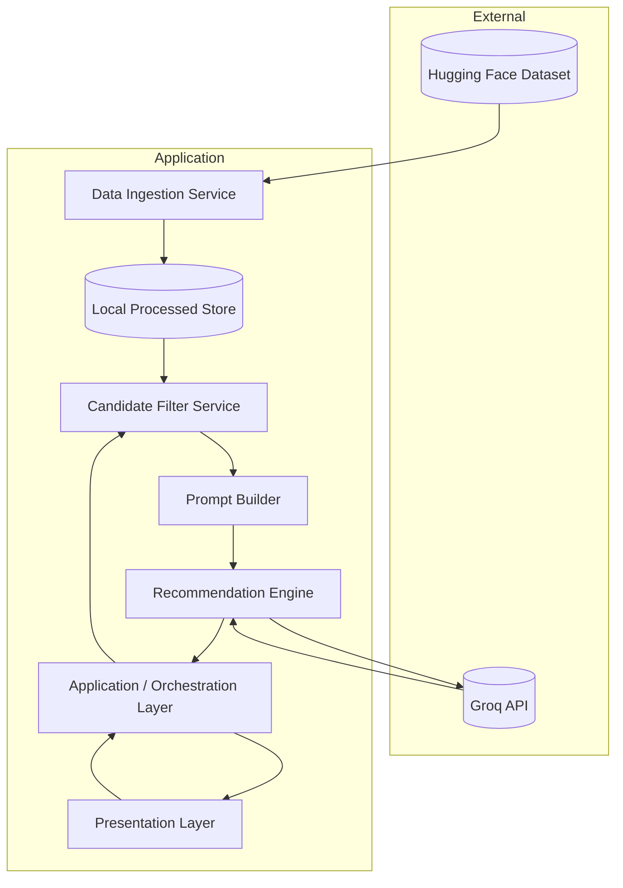
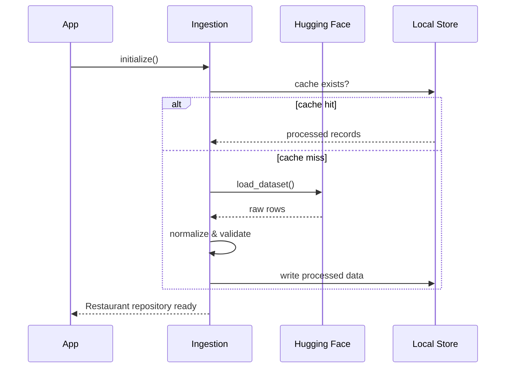
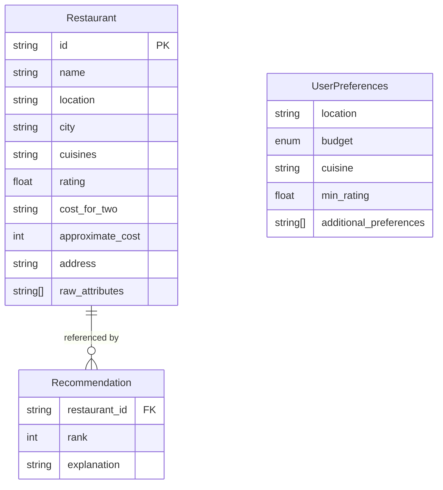
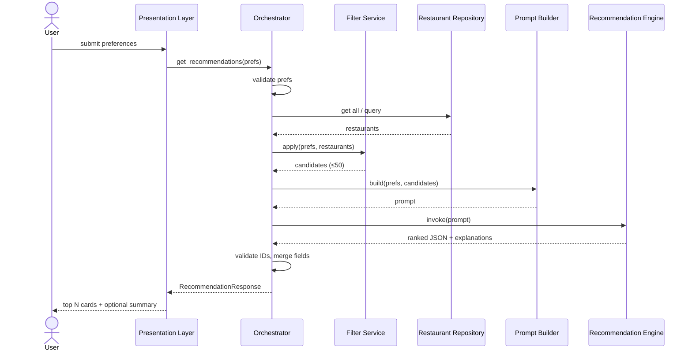
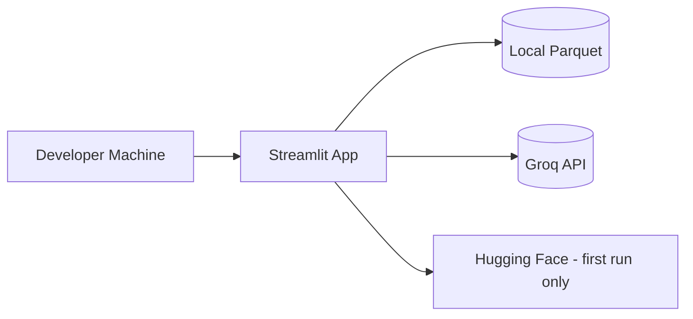
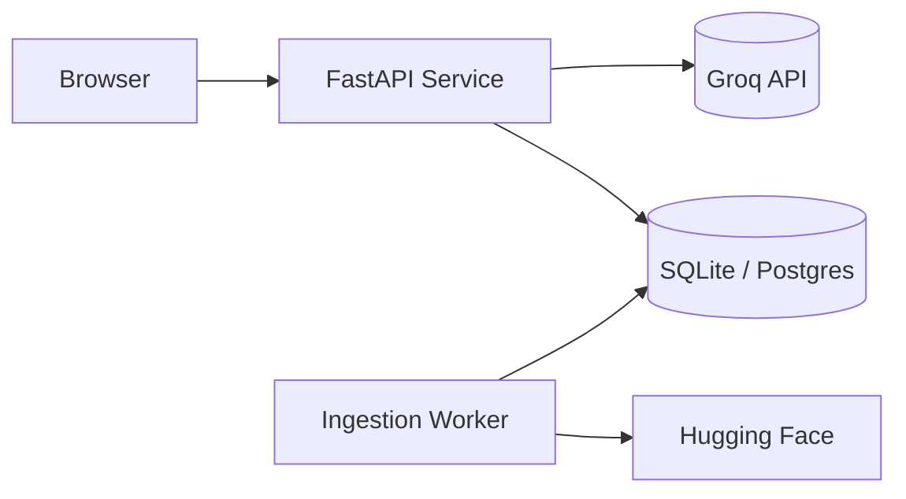

# System Architecture: AI-Powered Restaurant Recommendation System

This document defines the technical architecture for the Zomato-inspired recommendation service described in [`context.md`](../context.md) and [`problemStatement.txt`](problemStatement.txt).

---

## Table of Contents

1. [Architectural Goals](#1-architectural-goals)
2. [High-Level Architecture](#2-high-level-architecture)
3. [Component Design](#3-component-design)
4. [Data Architecture](#4-data-architecture)
5. [Request Lifecycle](#5-request-lifecycle)
6. [LLM Integration Architecture](#6-llm-integration-architecture)
7. [Presentation Layer](#7-presentation-layer)
8. [Suggested Module Layout](#8-suggested-module-layout)
9. [Technology Stack](#9-technology-stack)
10. [Non-Functional Requirements](#10-non-functional-requirements)
11. [Security & Configuration](#11-security--configuration)
12. [Error Handling & Observability](#12-error-handling--observability)
13. [Deployment Topology](#13-deployment-topology)
14. [Future Extensions](#14-future-extensions)

---

## 1. Architectural Goals

| Goal | Description |
|------|-------------|
| **Grounded recommendations** | Every suggestion must map to a real record from the Hugging Face Zomato dataset (~51.7k rows). |
| **Hybrid intelligence** | Deterministic filtering reduces noise and token cost; the LLM handles ranking, explanation, and optional summarization. |
| **Explainability** | Each top result includes a natural-language rationale tied to explicit user preferences. |
| **Separation of concerns** | Ingestion, filtering, prompting, and UI are isolated modules with clear contracts. |
| **Testability** | Core logic (filters, schema mapping, prompt assembly) is unit-testable without live LLM calls. |

### Design Principles (from project context)

- Filter first, reason second — never send the full dataset to the LLM.
- Fail closed on invalid user input; return actionable validation messages.
- Prefer structured LLM output (JSON) over free-form text for reliable UI binding.
- Cache preprocessed data locally after first load to avoid repeated Hugging Face downloads.

---

## 2. High-Level Architecture

The system follows a **layered pipeline architecture** with five logical tiers.



### Layer Responsibilities

| Layer | Responsibility |
|-------|----------------|
| **Data Ingestion** | Download, validate, normalize, and persist restaurant records |
| **Candidate Filter** | Apply hard constraints from user preferences on structured data |
| **Integration / Prompt** | Serialize candidates + preferences into an LLM-ready prompt |
| **Recommendation Engine** | Call LLM, parse response, validate against candidate set |
| **Presentation** | Collect input, render ranked results with explanations |

---

## 3. Component Design

### 3.1 Data Ingestion Service

**Purpose:** Load `ManikaSaini/zomato-restaurant-recommendation` from Hugging Face and produce a canonical internal schema.

**Responsibilities:**

- Fetch dataset via `datasets` library (or equivalent)
- Map raw columns to internal `Restaurant` model
- Normalize text (trim, case-fold location/cuisine for matching)
- Parse ratings and cost into comparable numeric / enum values
- Drop or flag incomplete records (missing name, location, or rating)
- Persist processed output (Parquet, JSONL, or SQLite) for fast reuse

**Outputs:**

- `Restaurant[]` in memory or on-disk cache
- Ingestion metadata (row count, schema version, last sync timestamp)



### 3.2 User Preference Collector

**Purpose:** Capture and validate end-user constraints before filtering.

**Input contract (`UserPreferences`):**

| Field | Type | Required | Notes |
|-------|------|----------|-------|
| `location` | string | Yes | City or area; fuzzy match against dataset location fields |
| `budget` | enum | Yes | `low` \| `medium` \| `high` — mapped to cost ranges |
| `cuisine` | string | No | Substring or token match on cuisine field |
| `min_rating` | float | No | Default e.g. 3.5 if omitted |
| `additional_preferences` | string[] | No | Free-text tags: "family-friendly", "quick service" |

**Validation rules:**

- `location` non-empty after trim
- `min_rating` in [0, 5] if provided
- `budget` must be a known enum value

### 3.3 Candidate Filter Service

**Purpose:** Deterministically narrow the corpus to a bounded candidate set (recommended cap: **20–50** restaurants) before LLM invocation.

**Filter pipeline (ordered):**

1. **Location filter** — exact or contains match on city/address/locality
2. **Cuisine filter** — if specified, match cuisine tokens
3. **Rating filter** — `rating >= min_rating`
4. **Budget filter** — map `low` / `medium` / `high` to cost percentiles or fixed thresholds derived from dataset distribution
5. **Optional keyword filter** — lightweight text match on restaurant name or listed attributes for `additional_preferences`

**Fallback strategy:**

| Condition | Behavior |
|-----------|----------|
| Zero candidates | Relax least-critical constraint (e.g. cuisine) and retry once; inform user |
| Too many candidates (>50) | Sort by rating desc, take top 50 by rating/cost fit |
| Still zero | Return empty state with suggestions to broaden search |

### 3.4 Prompt Builder (Integration Layer)

**Phase 4 provider:** [Groq](https://console.groq.com/) (OpenAI-compatible chat API via the `groq` Python SDK).

**Purpose:** Transform `UserPreferences` + `Restaurant[]` candidates into a structured prompt.

**Prompt structure:**

1. **System message** — role, constraints (only recommend from provided list, output JSON)
2. **User context** — serialized preferences
3. **Candidate block** — compact JSON array of restaurants (id, name, cuisine, rating, cost, location snippet)
4. **Task instructions** — rank top N (e.g. 5), explain each, optional one-paragraph summary

**Design constraints:**

- Include stable `restaurant_id` in each candidate so the LLM references real rows
- Instruct the model not to invent restaurants or fields
- Request fixed JSON schema for downstream parsing

### 3.5 Recommendation Engine (LLM)

**Purpose:** Invoke the LLM and produce validated `RecommendationResult[]`.

**Core operations:**

| Step | Action |
|------|--------|
| 1 | Send prompt to LLM provider |
| 2 | Parse JSON response |
| 3 | Validate each `restaurant_id` exists in candidate set |
| 4 | Merge LLM explanations with canonical restaurant fields from datastore |
| 5 | Apply final sort if model ranking is inconsistent |

**LLM responsibilities (per context):**

- Rank restaurants by preference fit
- Generate per-restaurant explanations
- Optionally produce an overall summary of choices

**What the LLM must NOT do:**

- Introduce restaurants outside the candidate list
- Override hard filters (e.g. recommend below `min_rating`)

### 3.6 Orchestration Layer

**Purpose:** Coordinate the end-to-end flow for a single recommendation request.

```python
# Pseudocode — orchestration contract
def get_recommendations(prefs: UserPreferences) -> RecommendationResponse:
    validate(prefs)
    candidates = filter_service.apply(repository.all(), prefs)
    if not candidates:
        return empty_response_with_hints(prefs)
    prompt = prompt_builder.build(prefs, candidates)
    raw = recommendation_engine.invoke(prompt)
    results = recommendation_engine.validate_and_enrich(raw, candidates)
    return RecommendationResponse(
        recommendations=results,
        summary=raw.summary,
        metadata={"candidate_count": len(candidates)},
    )
```

### 3.7 Presentation Layer

**Purpose:** User-facing interface for input and results.

**Supported deployment shapes (choose one for milestone):**

| Option | Pros | Cons |
|--------|------|------|
| **Streamlit / Gradio** | Fast to build, ideal for demos | Less customizable UX |
| **Web app (React + API)** | Production-like separation | More boilerplate |
| **CLI** | Simplest for backend-only milestone | Limited UX |

**Result card fields (required per context):**

- Restaurant name
- Cuisine
- Rating
- Estimated cost
- AI-generated explanation

---

## 4. Data Architecture

### 4.1 Canonical Domain Model



### 4.2 Internal `Restaurant` Schema (target)

Fields are mapped from the Hugging Face dataset at ingestion time. Exact source column names are discovered on first load; the ingestion layer owns the mapping table.

| Internal field | Description | Used in |
|----------------|-------------|---------|
| `id` | Stable hash or row index | LLM reference, deduplication |
| `name` | Restaurant name | Display, prompt |
| `location` / `city` | Geographic filter | Filter, display |
| `cuisines` | Normalized cuisine string | Filter, display |
| `rating` | Numeric rating | Filter, display, sort |
| `approximate_cost` | Normalized cost indicator | Budget filter, display |
| `address` | Optional full address | Display |

### 4.3 Budget Mapping Strategy

Because user budget is categorical (`low` / `medium` / `high`), derive thresholds from dataset cost distribution at ingestion time:

| Budget tier | Rule (example) |
|-------------|----------------|
| `low` | cost ≤ 33rd percentile |
| `medium` | 33rd < cost ≤ 66th percentile |
| `high` | cost > 66th percentile |

Percentiles are computed per city when sample size allows; otherwise use global percentiles.

### 4.4 Data Store Options

| Store | Use case |
|-------|----------|
| **In-memory list** | Milestone / small demos |
| **Parquet file** | Fast reload, simple deployment |
| **SQLite** | Indexed filters on location, cuisine, rating |

**Recommendation for milestone:** Parquet or SQLite after first Hugging Face download.

---

## 5. Request Lifecycle



### Latency Budget (typical)

| Stage | Target |
|-------|--------|
| Filter (local) | < 100 ms |
| Prompt build | < 10 ms |
| LLM call | 2–15 s (provider-dependent) |
| Parse & enrich | < 50 ms |

---

## 6. LLM Integration Architecture

### 6.1 Provider Abstraction

Define a narrow `LLMClient` interface so the recommendation engine stays decoupled from vendor SDKs. **Phase 4 implements this with Groq** (not OpenAI): fast inference, low cost for demo workloads, and an OpenAI-compatible chat-completions API.

```text
LLMClient.complete(prompt: str, system: str) -> str
```

**Phase 4 default implementation:** `GroqLLMClient` using the official `groq` package (`Groq.chat.completions.create`). Other providers (Anthropic, local Ollama, etc.) can be added later behind the same interface without changing the prompt builder or orchestrator.

### 6.2 Prompt Template (conceptual)

```text
[System]
You are a restaurant recommendation assistant for Zomato-style dining.
You MUST only recommend restaurants from the CANDIDATES list.
Return valid JSON matching the schema. Do not invent restaurants.

[User preferences]
{json_preferences}

[Candidates]
{json_candidates}

[Task]
Rank the top 5 restaurants for these preferences.
For each: restaurant_id, rank, explanation (1-2 sentences).
Optionally include a summary field (2-3 sentences).
```

### 6.3 Expected LLM Response Schema

```json
{
  "summary": "Optional overview of the selection.",
  "recommendations": [
    {
      "restaurant_id": "abc123",
      "rank": 1,
      "explanation": "Matches your Italian preference in Bangalore with strong ratings within a medium budget."
    }
  ]
}
```

### 6.4 Guardrails

| Guardrail | Implementation |
|-----------|----------------|
| Hallucination prevention | Whitelist validation on `restaurant_id` |
| Token limits | Cap candidates at 50; truncate long address fields in prompt |
| Retry on malformed JSON | Single retry with "return only valid JSON" instruction |
| Timeout | Configurable LLM timeout with user-friendly error |

### 6.5 Cost Control

- Send only filtered candidates, not full 51k rows
- Use compact JSON (essential fields only)
- Cache identical preference queries optionally (short TTL)

---

## 7. Presentation Layer

### 7.1 Input Form

Collect all preference fields defined in context:

- Location (dropdown populated from unique localities/areas in dataset, e.g. Indiranagar, Koramangala, Bellandur)
- Budget (radio: low / medium / high)
- Cuisine (text or autocomplete)
- Minimum rating (slider or number input)
- Additional preferences (tags or textarea)

### 7.2 Results View

```text
┌─────────────────────────────────────────────────────────┐
│  Summary (optional LLM paragraph)                       │
├─────────────────────────────────────────────────────────┤
│  #1  Restaurant Name          ★ 4.5                    │
│      Italian · ₹₹ · Bangalore                           │
│      "AI explanation why this fits your preferences…"   │
├─────────────────────────────────────────────────────────┤
│  #2  ...                                                │
└─────────────────────────────────────────────────────────┘
```

### 7.3 Empty & Error States

| State | User message |
|-------|----------------|
| No matches | "No restaurants match. Try lowering minimum rating or changing cuisine." |
| LLM failure | "Could not generate recommendations. Please try again." |
| Invalid input | Field-level validation errors |

---

## 8. Suggested Module Layout

```text
zomato-milestone/
├── context.md
├── docs/
│   ├── problemStatement.txt
│   └── architecture.md          # this file
├── src/
│   ├── main.py                  # entrypoint (CLI or app bootstrap)
│   ├── config.py                # env, API keys, paths
│   ├── models/
│   │   ├── restaurant.py
│   │   ├── preferences.py
│   │   └── recommendation.py
│   ├── data/
│   │   ├── ingestion.py         # Hugging Face load + normalize
│   │   ├── repository.py        # query interface
│   │   └── cache/               # processed dataset (gitignored)
│   ├── services/
│   │   ├── filter.py            # candidate filter pipeline
│   │   ├── prompt_builder.py
│   │   └── recommendation_engine.py
│   ├── llm/
│   │   └── client.py            # provider abstraction
│   └── ui/
│       └── app.py               # Streamlit / Gradio / API routes
├── tests/
│   ├── test_filter.py
│   ├── test_prompt_builder.py
│   └── test_validation.py
├── requirements.txt
└── .env.example
```

---

## 9. Technology Stack

| Concern | Suggested choice | Rationale |
|---------|------------------|-----------|
| Language | Python 3.10+ | Strong HF `datasets` + LLM SDK ecosystem |
| Dataset | `datasets` (Hugging Face) | Direct load from specified URL |
| Data processing | `pandas` / `pyarrow` | Normalization and Parquet export |
| LLM | **Groq** (`groq` SDK; Phase 4) | Fast hosted inference; `LLMClient` abstraction allows other providers later |
| UI (milestone) | Streamlit | Fast alignment with demo requirements |
| Config | `python-dotenv` | API keys outside source control |
| Tests | `pytest` | Filter and prompt unit tests |

---

## 10. Non-Functional Requirements

| Attribute | Target |
|-----------|--------|
| **Availability** | Single-user demo; graceful degradation if LLM unavailable |
| **Performance** | Filtering sub-second on cached data |
| **Scalability** | Not required for milestone; architecture allows API extraction later |
| **Maintainability** | Clear module boundaries per Section 8 |
| **Data freshness** | Manual or scripted re-ingestion when HF dataset updates |

---

## 11. Security & Configuration

| Item | Practice |
|------|----------|
| API keys | Store in `.env`; never commit secrets |
| LLM data | Send only necessary candidate fields; no PII beyond public restaurant data |
| Input sanitization | Escape or bound length on free-text preference fields |
| Dependencies | Pin versions in `requirements.txt` |

**Environment variables (example):**

```bash
LLM_PROVIDER=groq
LLM_API_KEY=gsk_...          # Groq API key from console.groq.com
LLM_MODEL=llama-3.3-70b-versatile
DATA_CACHE_PATH=./src/data/cache/restaurants.parquet
TOP_N_RECOMMENDATIONS=5
MAX_CANDIDATES_FOR_LLM=50
```

---

## 12. Error Handling & Observability

### Error Categories

| Category | Example | Handling |
|----------|---------|----------|
| Ingestion | HF download failure | Retry with backoff; surface clear setup instructions |
| Validation | Invalid `min_rating` | 400-style message to UI |
| Filter | Zero candidates | Relax constraints or empty state |
| LLM | Timeout / invalid JSON | Retry once; fallback message |
| Validation post-LLM | Unknown `restaurant_id` | Drop invalid entries; log warning |

### Logging (recommended fields)

- `request_id`, `preference_hash`, `candidate_count`, `llm_latency_ms`, `result_count`

---

## 13. Deployment Topology

### Milestone (local / demo)



### Optional production evolution



---

## 14. Future Extensions

These are out of scope for the initial milestone but compatible with this architecture:

- User accounts and saved preference profiles
- Geospatial radius search (lat/long)
- Embedding-based semantic match for `additional_preferences`
- A/B testing of prompt templates
- Feedback loop (thumbs up/down) to refine ranking prompts
- Batch offline evaluation against held-out preference scenarios

---

## Appendix A: Mapping to Project Context

| Context requirement | Architecture section |
|---------------------|----------------------|
| Hugging Face dataset ingestion | §3.1, §4 |
| User preferences input | §3.2, §7.1 |
| Filter + LLM prompt integration | §3.3, §3.4 |
| LLM rank + explain + summarize | §3.5, §6 |
| Display name, cuisine, rating, cost, explanation | §3.7, §7.2 |
| Hybrid filter-then-LLM approach | §2, §3.3 |
| Success criteria checklist | §1, §5, [`context.md`](../context.md) |

---

## Appendix B: References

- Project context: [`context.md`](../context.md)
- Problem statement: [`problemStatement.txt`](problemStatement.txt)
- Dataset: [ManikaSaini/zomato-restaurant-recommendation](https://huggingface.co/datasets/ManikaSaini/zomato-restaurant-recommendation)
