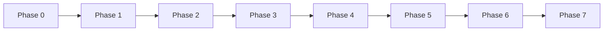

# Phase-Wise Implementation Plan

AI-powered Zomato-style restaurant recommendations, aligned with [`architecture.md`](architecture.md) and [`context.md`](../context.md).

---

## Overview

| Phase | Focus | Maps to success criteria |
|-------|--------|---------------------------|
| 0 | Scaffold & config | — |
| 1 | Data ingestion & store | Dataset loaded & preprocessed |
| 2 | Domain models & repository | — |
| 3 | Preference validation & filtering | User input + filter before LLM |
| 4 | Prompt builder & LLM client | — |
| 5 | Recommendation engine & orchestration | LLM rank + explain |
| 6 | Presentation (Streamlit) | UI shows all required fields |
| 7 | Tests, errors, polish | End-to-end milestone ready |

**Design thread (all phases):** filter first, reason second; grounded IDs only; structured JSON from the LLM.



---

## Phase 0: Project Foundation

**Goal:** Runnable Python project with layout, dependencies, and secrets handling per §8–§11 of the architecture doc.

### Tasks

1. Create module layout from architecture §8:
   - `src/models/`, `src/data/`, `src/services/`, `src/llm/`, `src/ui/`, `tests/`
2. Add `requirements.txt`: `datasets`, `pandas`, `pyarrow`, `python-dotenv`, **`groq`** (Phase 4 LLM SDK), `streamlit`, `pytest`
3. Add `.env.example` with `LLM_PROVIDER=groq`, `LLM_API_KEY`, `LLM_MODEL` (e.g. `llama-3.3-70b-versatile`), `DATA_CACHE_PATH`, `TOP_N_RECOMMENDATIONS`, `MAX_CANDIDATES_FOR_LLM`
4. Implement `src/config.py` — load env, defaults, paths
5. Add `.gitignore` for `src/data/cache/`, `.env`, `__pycache__`
6. Stub `src/main.py` entrypoint (CLI or Streamlit bootstrap later)

### Deliverables

- `pip install -r requirements.txt` succeeds
- `config` reads from `.env` without committing secrets

### Exit criteria

- [ ] Directory structure matches architecture §8
- [ ] Config module loads all documented env vars

---

## Phase 1: Data Ingestion & Local Store

**Goal:** Load `ManikaSaini/zomato-restaurant-recommendation` once, normalize, cache, and expose metadata (§3.1, §4).

### Tasks

1. **Discover schema** — first run: print/map HF columns to internal fields
2. **`src/data/ingestion.py`**
   - Load via `datasets.load_dataset(...)`
   - Map to canonical `Restaurant` fields: `id`, `name`, `location`/`city`, `cuisines`, `rating`, `approximate_cost`, `address`
   - Normalize text (trim, case-fold for matching)
   - Drop rows missing name, location, or rating
   - Compute **budget percentiles** (global; per-city when N is large enough) for `low` / `medium` / `high` (§4.3)
3. **Persist cache** — Parquet at `DATA_CACHE_PATH` (architecture recommendation for milestone)
4. **Cache-first init** — if Parquet exists, skip HF download
5. Log ingestion metadata: row count, schema version, last sync timestamp

### Deliverables

- `src/data/cache/restaurants.parquet` (gitignored)
- Ingestion script or `initialize()` callable from app startup

### Exit criteria

- [ ] ~51k rows processed (minus dropped incomplete records)
- [ ] Second startup loads from cache in seconds, not re-downloading HF
- [ ] Budget tier thresholds stored or computable from cached data

**Maps to context:** “Dataset loaded and preprocessed from Hugging Face”

---

## Phase 2: Domain Models & Repository

**Goal:** Typed contracts and a query surface for filters and LLM enrichment (§4.1, §3.1 outputs).

### Tasks

1. **`src/models/restaurant.py`** — `Restaurant` dataclass/Pydantic model
2. **`src/models/preferences.py`** — `UserPreferences` with `location`, `budget` enum, optional `cuisine`, `min_rating`, `additional_preferences`
3. **`src/models/recommendation.py`** — `Recommendation`, `RecommendationResponse` (recommendations, summary, metadata)
4. **`src/data/repository.py`**
   - `load()` from Parquet → in-memory list (milestone) or lazy load
   - `all()` for filter pipeline
   - Optional: `unique_cities()` for UI dropdowns

### Deliverables

- Importable models used by later phases
- Repository returns `list[Restaurant]` after ingestion init

### Exit criteria

- [ ] Models match architecture tables in §3.2 and §4.2
- [ ] Repository is the single source of restaurant records for the app

---

## Phase 3: User Preferences & Candidate Filter

**Goal:** Validate input and deterministically narrow to 20–50 candidates before any LLM call (§3.2, §3.3, design principle “filter first”).

### Tasks

1. **Validation** (`validate(prefs)`)
   - Non-empty `location`
   - `budget` in `low|medium|high`
   - `min_rating` in [0, 5] if set; default e.g. 3.5
   - Fail closed with actionable field errors
2. **`src/services/filter.py`** — ordered pipeline:
   1. Location (contains / fuzzy on city/locality)
   2. Cuisine (if specified)
   3. Rating ≥ `min_rating`
   4. Budget tier via percentile mapping
   5. Optional keyword match for `additional_preferences`
3. **Fallbacks** (§3.3):
   - 0 candidates → relax cuisine once, notify user
   - >50 candidates → top 50 by rating (and cost fit if useful)
   - Still 0 → empty state hints
4. Unit tests: `tests/test_filter.py` with small fixture dataset (no LLM)

### Deliverables

- `filter_service.apply(restaurants, prefs) -> list[Restaurant]`

### Exit criteria

- [ ] Filtering completes in <100 ms on cached data (architecture latency target)
- [ ] Candidate count always ≤ `MAX_CANDIDATES_FOR_LLM` (default 50)
- [ ] Tests cover location, budget, rating, empty, and overflow cases

**Maps to context:** “User can specify preferences” + “System filters candidates before LLM processing”

---

## Phase 4: Prompt Builder & LLM Client

**Goal:** Groq-backed LLM access (via a thin `LLMClient` abstraction) and a structured prompt that only references real candidates (§3.4, §6).

**LLM provider:** [Groq](https://console.groq.com/) — not OpenAI. Use the `groq` Python SDK and chat-completions API.

### Tasks

1. **`src/llm/client.py`**
   - `LLMClient.complete(prompt, system) -> str` interface
   - **`GroqLLMClient`** — `Groq(api_key=...).chat.completions.create(model=..., messages=[...])`
   - Read `LLM_PROVIDER`, `LLM_API_KEY`, `LLM_MODEL` from config (default provider: `groq`, default model: `llama-3.3-70b-versatile`)
   - Optional: factory that selects client by `LLM_PROVIDER` for future providers
2. **`src/services/prompt_builder.py`**
   - System message: role, JSON-only, no invented restaurants
   - User block: serialized `UserPreferences`
   - Candidates: compact JSON (`restaurant_id`, name, cuisine, rating, cost, location snippet)
   - Task: rank top N (default 5), per-item explanation, optional summary
3. Define expected response schema (architecture §6.3) as a typed structure for parsing
4. Unit tests: `tests/test_prompt_builder.py` — snapshot or assert structure, candidate cap, IDs present

### Deliverables

- Prompt template with stable `restaurant_id` in every candidate
- Working `GroqLLMClient` wired through env (`LLM_PROVIDER=groq`, `LLM_API_KEY`, `LLM_MODEL`)

### Exit criteria

- [ ] Prompt includes only filtered candidates (never full 51k)
- [ ] Prompt builder tests pass without live API calls
- [ ] Token-conscious payload (essential fields only, truncated addresses)
- [ ] Groq client returns a completion when called with valid API key (manual or integration smoke test)

---

## Phase 5: Recommendation Engine & Orchestration

**Goal:** End-to-end recommendation flow with guardrails (§3.5, §3.6, §6.4).

### Tasks

1. **`src/services/recommendation_engine.py`**
   - `invoke(prompt)` → raw string
   - Parse JSON; **single retry** on malformed JSON with “valid JSON only” instruction
   - **Whitelist** `restaurant_id` against candidate set; drop unknown IDs, log warning
   - Merge LLM explanations with canonical restaurant fields
   - Re-sort by `rank` if model order is inconsistent
   - Configurable timeout with user-friendly error
2. **Orchestrator** (in `main.py` or `src/services/orchestrator.py`):

   ```text
   validate → filter → prompt → invoke → validate_and_enrich → RecommendationResponse
   ```

   - Empty candidates → `empty_response_with_hints(prefs)`
   - Attach metadata: `candidate_count`, optional `request_id`
3. Unit tests: `tests/test_validation.py` — mock LLM JSON, hallucinated IDs, partial responses

### Deliverables

- `get_recommendations(prefs) -> RecommendationResponse`

### Exit criteria

- [ ] No recommendation returned for IDs outside candidate set
- [ ] Each result has rank + explanation + merged restaurant fields
- [ ] Optional `summary` field populated when LLM provides it
- [ ] LLM failure path returns clear error (no crash)

**Maps to context:** “LLM ranks options and provides per-restaurant explanations”

---

## Phase 6: Presentation Layer (Streamlit)

**Goal:** Demo-ready UI collecting all preference fields and showing result cards (§7, architecture UI choice).

### Tasks

1. **`src/ui/app.py`** (Streamlit)
   - **Input form:** location (locality/area dropdown from `unique_locations()`, e.g. Indiranagar, Koramangala, Bellandur), budget radio, cuisine, min rating slider, additional preferences (tags/textarea)
   - **Submit** → call orchestrator; show loading during LLM (2–15 s)
   - **Results view:** optional summary paragraph; cards for top N with name, cuisine, rating, cost, AI explanation
   - **States:** validation errors, no matches, LLM failure (§7.3)
2. Wire `streamlit run src/ui/app.py` (or document in README)
3. Display filter relaxation message when fallback applied

### Deliverables

- Runnable demo on developer machine (architecture §13 milestone topology)

### Exit criteria

- [ ] All five preference dimensions collectible
- [ ] Each card shows: name, cuisine, rating, cost, explanation
- [ ] Empty and error states are user-readable

**Maps to context:** “UI shows name, cuisine, rating, cost, and explanation for top picks”

---

## Phase 7: Hardening, Observability & Milestone Sign-Off

**Goal:** Production-quality demo: logging, docs, and success-criteria checklist.

### Tasks

1. **Logging** — `request_id`, `candidate_count`, `llm_latency_ms`, `result_count` (§12)
2. **Error handling** — ingestion retry/backoff; ingestion setup instructions in README
3. **README** — setup (HF first run, `.env`, run UI), architecture pointer
4. **Manual test matrix** — e.g. Bangalore + medium + Italian; edge: impossible filters; invalid rating
5. Walk through **Success Criteria** in `context.md` and tick each item

### Deliverables

- Documented runbook
- Passing `pytest` for filter, prompt, validation

### Exit criteria (full milestone)

| # | Criterion | Verified by |
|---|-----------|-------------|
| 1 | Dataset loaded & preprocessed | Phase 1 + cache reload |
| 2 | User specifies all preference types | Phase 6 form |
| 3 | Filter before LLM | Phase 3 + orchestrator |
| 4 | LLM rank + explain (+ optional summary) | Phase 5 |
| 5 | UI shows all required fields | Phase 6 |

---

## Suggested Timeline (indicative)

| Phase | Effort (solo) | Depends on |
|-------|----------------|------------|
| 0 | 0.5 day | — |
| 1 | 1–1.5 days | 0 |
| 2 | 0.5 day | 1 |
| 3 | 1 day | 2 |
| 4 | 1 day | 2 |
| 5 | 1–1.5 days | 3, 4 |
| 6 | 1 day | 5 |
| 7 | 0.5–1 day | 6 |

**Critical path:** 0 → 1 → 2 → 3 → 5 and 0 → 1 → 2 → 4 → 5 (Phases 3 and 4 can run in parallel after Phase 2).

---

## Risk Mitigations (by phase)

| Risk | Mitigation |
|------|------------|
| HF column names differ from assumptions | Phase 1 schema discovery + mapping table in ingestion |
| LLM hallucinates restaurants | Phase 5 ID whitelist; Phase 4 prompt constraints |
| Token/cost blowup | Phase 3 cap at 50; Phase 4 compact JSON |
| Slow first run | Phase 1 Parquet cache |
| Zero matches frustrate users | Phase 3 relax cuisine + Phase 6 empty-state copy |

---

## Out of Scope (post-milestone)

Per architecture §14: user accounts, geo-radius search, embedding-based `additional_preferences`, FastAPI + React split, feedback loop. This plan stops at a local Streamlit demo with optional CLI stub in Phase 0.

---

## Optional: Phase 0.5 Spike (recommended before Phase 1)

Spend 1–2 hours on a notebook or script that loads the HF dataset, prints columns, sample rows, and cost/rating distributions. This de-risks Phase 1 mapping and Phase 3 budget percentiles.

---

## References

- [System architecture](architecture.md)
- [Project context](../context.md)
- [Problem statement](problemStatement.txt)
- Dataset: [ManikaSaini/zomato-restaurant-recommendation](https://huggingface.co/datasets/ManikaSaini/zomato-restaurant-recommendation)
